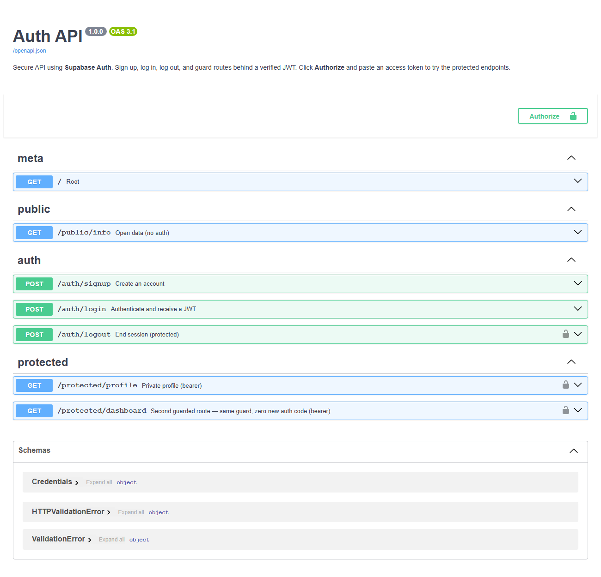

# Auth API · Login & protect — FlyRank A4

A secure API built on **Supabase Auth**: sign up, log in, log out, and guard routes behind a verified **JWT**. Supabase stores accounts, hashes passwords, and signs tokens; this backend's job is to *receive a token, verify it, and open or refuse the door*. No cryptography is written here.

## The trust triangle

```
1. Client -> Supabase   : sign up / log in (email + password)
2. Supabase -> Client   : returns a signed JWT (access token)
3. Client -> this API   : calls a route with  Authorization: Bearer <token>
4. this API -> Supabase : "is this token real?"  yes -> open the door
```

## Endpoints

| Route | Purpose | Auth | Codes |
|-------|---------|------|-------|
| `POST /auth/signup` | create account | none | 201 / 400 |
| `POST /auth/login` | authenticate → JWT | none | 200 / 400 / 401 |
| `POST /auth/logout` | end session | Bearer | 204 / 401 |
| `GET /protected/profile` | private profile | Bearer | 200 / 401 |
| `GET /protected/dashboard` | 2nd guarded route (same guard) | Bearer | 200 / 401 |
| `GET /public/info` | open data | none | 200 |

Every error is a top-level `{"error": "..."}`.

## Setup (one manual step — your Supabase keys)

The assignment requires your own free Supabase project:

1. Create a project at [supabase.com](https://supabase.com) (no card).
2. **Project Settings → API**: copy the **Project URL** and the **anon** public key. (Never the `service_role` key — it bypasses security.)
3. `cp .env.example .env` and paste both values.
4. **Authentication → Sign In / Providers → Email**: turn **Confirm email** off so a fresh signup can log in immediately (leave it on in production).

```
SUPABASE_URL=https://your-project-ref.supabase.co
SUPABASE_KEY=your-anon-public-key
```

## Run

```bash
pip install -r requirements.txt && uvicorn app:app --reload --port 8000
```

Swagger: http://localhost:8000/docs

## The reusable guard

The token check lives once in `auth.py` (`get_current_user`) and is applied to **three** routes (`/protected/profile`, `/protected/dashboard`, `/auth/logout`) — miss-one-door bugs come from copy-pasting auth into every handler, so it's a single dependency instead.

## Swagger with bearer auth

`HTTPBearer` puts the **Authorize** padlock on `/docs` and a lock icon on every protected route. Click Authorize, paste a JWT from `/auth/login`, and call the protected endpoints from the browser.



## Verified (without secrets)

These paths need no Supabase keys and are confirmed passing:

```
GET  /public/info         -> 200
GET  /protected/profile   -> 401 {"error":"Access token required"}   (no token)
GET  /protected/dashboard -> 401                                     (reused guard)
POST /auth/signup (no pw) -> 400 {"error":"email and password are required"}
POST /auth/login (no em)  -> 400
POST /auth/logout (no tok)-> 401
```

The full signup → login → verified `/protected/profile` → tampered-token-401 cycle runs once your `.env` has real Supabase keys.

## AI vs me (Stage 7)

Prompts: [`ai-version/PROMPT_v1.md`](ai-version/PROMPT_v1.md), [`ai-version/PROMPT_v2.md`](ai-version/PROMPT_v2.md).

Reviewing [`ai-version/main.py`](ai-version/main.py) (v1):

1. **Bearer prefix not stripped** — it passes the raw `Authorization` header (`"Bearer eyJ..."`) straight to `get_user`, so a correct token fails and `Authorization: <token>` behaves inconsistently. The hand-built version uses `HTTPBearer`, which parses the prefix for you.
2. **Wrong status code** — a missing token returns `200 {"error": "no token"}` instead of **401**.
3. **Trusts `get_user` blindly** — never checks whether `user` is `None`, so a rejected token could still open the door.
4. **No reusable guard, no logout** — the check can't be shared across routes; a second protected route would duplicate it.

**What my prompt forgot (v1):** I didn't specify the exact error shape, didn't say "reusable dependency on more than one route", and didn't demand correct Bearer parsing. The rematch prompt ([`PROMPT_v2.md`](ai-version/PROMPT_v2.md)) fixes all three, and [`ai-version/main_v2.py`](ai-version/main_v2.py) lands close to the submission.

```bash
git diff --no-index app.py ai-version/main.py
git diff --no-index auth.py ai-version/main_v2.py
```

## Security notes

- `.env` is git-ignored; only `.env.example` is committed. Supabase keys never reach GitHub (bots scrape leaked keys within a minute).
- The **anon** key is public-safe; the `service_role` key is never used here.
- `401` = "I don't know you" (missing/bad token); `403` = "I know you, and no" (authorization) — a natural next extra.

## Commits

- Stage 0: setup server and supabase client
- Stage 1: signup and login routes working
- Stage 2: public route and unverified protected route
- Stage 3: profile route token verification
- Stage 4: auth middleware and logout endpoint
- Stage 5: Swagger UI documentation with bearer auth
- Stage 6: publish to GitHub and write README
- Stage 7: AI vs me

## License

MIT — FlyRank Backend internship.
